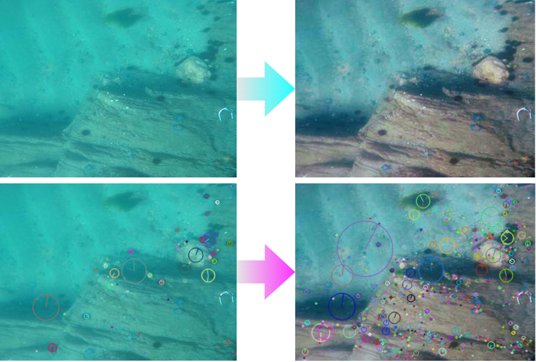
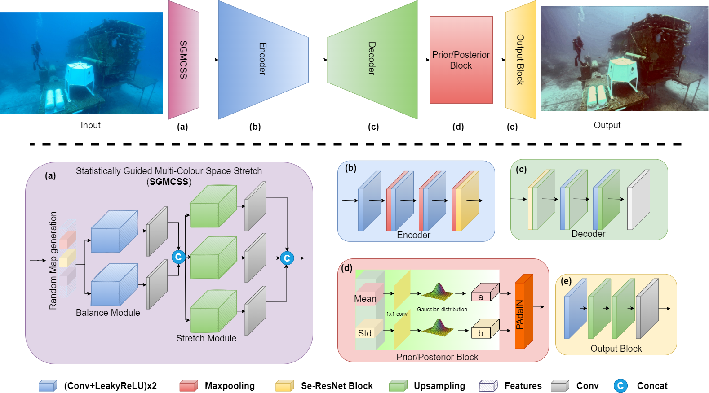

# Adaptive deep learning framework for robust unsupervised underwater image enhancement  ([Paper](https://www.sciencedirect.com/science/article/pii/S0957417424031816))

[](https://opensource.org/licenses/MIT)
[](https://pytorch.org/)


The Pytorch Implementation of ''Adaptive deep learning framework for robust unsupervised underwater image enhancement''. 

<div align=center></div>

## Abstract
One of the main challenges in deep learning-based underwater image enhancement is the limited availability of high-quality training data. Underwater images are often difficult to capture and typically suffer from distortion, colour loss, and reduced contrast, complicating the training of supervised deep learning models on large and diverse datasets. This limitation can adversely affect the performance of the model. In this paper, we propose an alternative approach to supervised underwater image enhancement. Specifically, we introduce a novel framework called Uncertainty Distribution Network (UDnet), which adapts to uncertainty distribution during its unsupervised reference map (label) generation to produce enhanced output images. UDnet enhances underwater images by adjusting contrast, saturation, and gamma correction. It incorporates a statistically guided multicolour space stretch module (SGMCSS) to generate a reference map, which is utilized by a U-Net-like conditional variational autoencoder module (cVAE) for feature extraction. These features are then processed by a Probabilistic Adaptive Instance Normalization (PAdaIN) block that encodes the feature uncertainties for the final image enhancement. The SGMCSS module ensures visual consistency with the input image and eliminates the need for manual human annotation. Consequently, UDnet can learn effectively with limited data and achieve state-of-the-art results. We evaluated UDnet on eight publicly available datasets, and the results demonstrate that it achieves competitive performance compared to other state-of-the-art methods in both quantitative and qualitative metrics. Our code is publicly available at https://github.com/alzayats/UDnet.

## Introduction
<div align=center></div>
We present a fully trainable framework to enhance underwater images without ground truth. 
We demonstrate that our proposed model outperforms ten popular underwater image enhancement methods on seven common  metrics, 
in both paired and unpaired settings.


## Requirement
In this project, we use Linux host with a single NVidia GeForce RTX 2080 Ti GPU with 11 GB of memory, Python 3.7, Pytorch 1.9.1.

## Running

### Inference

Download the pretrained model [pretrained model](https://drive.google.com/file/d/1SsOoMmO1V2cuYDoFIWfQT_MPmx5lmYZu/view?usp=sharing).

Check  the model and image pathes in Inference.py, and then run:

```
python Inference.py  
```

### Training

To train the model, you need to download Underwater Dataset [dataset](https://github.com/xahidbuffon/Awesome_Underwater_Datasets).

Check  the dataset path in Train.py, and then run:
```
python Train.py   
```

## Bibtex

If you find UDnet is useful in your research, please cite our paper:


```
@article{SALEH2025126314,
title = {Adaptive deep learning framework for robust unsupervised underwater image enhancement},
journal = {Expert Systems with Applications},
volume = {268},
pages = {126314},
year = {2025},
issn = {0957-4174},
doi = {https://doi.org/10.1016/j.eswa.2024.126314},
url = {https://www.sciencedirect.com/science/article/pii/S0957417424031816},
author = {Alzayat Saleh and Marcus Sheaves and Dean Jerry and Mostafa {Rahimi Azghadi}},
keywords = {Computer vision, Convolutional neural networks, Underwater image enhancement, Variational autoencoder, Machine learning, Deep learning},
}
```

## License
The code is made available for academic research purpose only. This project is open sourced under MIT license.

## Credit
https://github.com/zhenqifu/PUIE-Net \
https://github.com/deepxzy/USLN \
https://github.com/xueleichen/PyTorch-Underwater-Image-Enhancement
